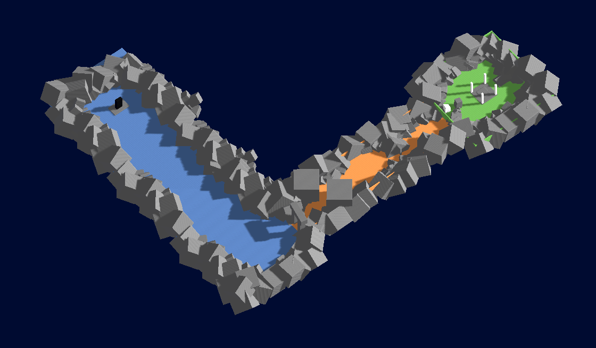
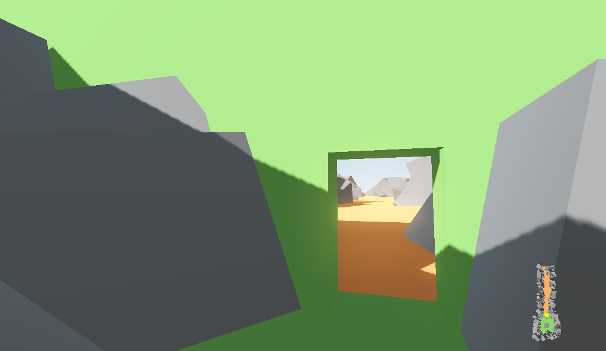

# Zone Loading System

This template shows you how your game can automatically load/unload zones according to your player position. By implementing this template in your game you can have a seamless world as big as needed, without loading screens.

This works for both 2D games and 3D games, try the demo by executing this project.

Note that it is not a chunk system based on distance to the player, if you need chunks loading for an open world, please check other solutions.

## Pros
- Good if loading the whole world at once would take too much time/memory.
- Allows huge seamless worlds without loading screen.
- Works for 2D and 3D.

## Cons
- Useless if your whole world can be quickly loaded in memory, or if you don't mind loading screens.
- Need to manually split the game world into zones and set triggers.
- In 3D, zones need to be carfully designed so that player cannot see unloaded zones (needs twists and turns or fog).

## How does it work ?

Each zone of your world sits inside a trigger area that is larger than the zone, the areas should be overlapping.

Zones overlapping the one the player is in are preloaded (loaded but not attached to the game tree). This mean the zone should be already loaded when the player enters a new area.

When the player enters a new zone, the zone is attached to the tree (made visible).
When the player exits the zone, the zone is detached from the tree, but kept in memory in case the player returns.

Zones no longer overlapping the one the player is in are unloaded (freed from memory).

## Background loading

All the loading and instancing is done by one background thread that runs parallel to your main game, so it should not create stutters, please check "background_loader.gd". 

The thread is automatically started at thes start of the game, and stopped at the end. Stopping the thread can take a few seconds if the thread is currently loading data.

## Configure the player

- For 2D, add an Area2D to your player's camera with a collision shape covering the whole screen. This way zones will be loaded when they become visible on screen.
- For 3D, add an Area to your player's camera with a collision shape encompassing the player.
- Set the area's collision mask to "zone_triggers" (leave collision layer empty), this way the area will collide only with zone triggers.
- Assign your player scene to the world's "Player Scene" attribute, it will be automatically spawned on world load, at the location of a node in the group PLAYER_SPAWN.

## Add a new zone

- Create a zone, save it as a separate scene.
- Create a new node under `World/ZoneLoader`, name it with your zone name.
- Attach the script `zone.gd` to the node
- Set the zone path in the inspector
- Click the checkbox "Preview" to make the zone visible
- Move the zone node where you want it to be relative to the other zones
- Add a new Area (or Area2D) node as child, name it `ZoneTrigger`
- Set the collision layer and mask to `zone_triggers`
- Add one or more collision shapes that encompasses the zone, the zone will be loaded when the player enters this area

Done. Now the zone will be loaded, instanced and attached to the tree automatically by the system.

## Known issues

### Stutter when a new zone is attached to the tree
- New shaders are being compiled. Limit the number of different shader you use and use a shader cache to precompile the shaders during loading screen.
- outputting to the console using print() and errors can create stutters.

### Error: _body_enter_tree: Condition "!E" is true (fixed in Godot 3.4 beta 4!).

- Can happen when exiting and reentering a zone in 3D, this is a bug in Godot before 3.4 beta 4.

### Objects/monsters are reset when going back

- You need to save your zone data when it is unloaded and restore it when the zone is loaded, it is not in the scope of this template.

## Contribute

You can leave comments here: https://github.com/Yogoda/ZoneLoadingSystem/issues/3

You are free to submit issues, contribute and improve this template, this is a [Creative Commons](https://creativecommons.org/publicdomain/zero/1.0/)

Big thanks to *rmvermeulen* and *Wrzlprnft* for their contributions!

